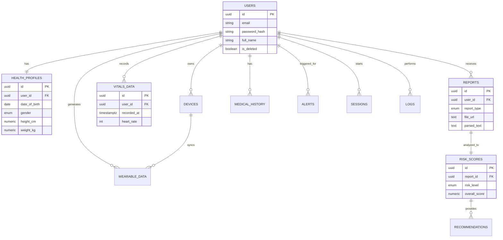

# ArogyaAI Production Database Schema

This document provides a complete, production-ready PostgreSQL schema for the ArogyaAI platform, following the requirements and existing SQLAlchemy models.

## 1. FULL SQL SCHEMA

```sql
-- ArogyaAI Production Database Schema
-- Version: 1.0.0
-- Description: Complete schema for health-tech platform including time-series support.

-- Enable UUID extension
CREATE EXTENSION IF NOT EXISTS "uuid-ossp";

-- ───────────────────────────────────────────────────────────────────────────
-- 1. ENUMS
-- ───────────────────────────────────────────────────────────────────────────

CREATE TYPE gender_enum AS ENUM ('MALE', 'FEMALE', 'OTHER', 'PREFER_NOT_TO_SAY');
CREATE TYPE device_type_enum AS ENUM ('SMARTWATCH', 'FITNESS_BAND', 'BPMONITOR', 'GLUCOMETER', 'WEIGHING_SCALE', 'OTHER');
CREATE TYPE report_type_enum AS ENUM ('BLOOD_TEST', 'MRI', 'XRAY', 'PRESCRIPTION', 'CLINICAL_NOTE', 'GENETIC', 'OTHER');
CREATE TYPE report_status_enum AS ENUM ('PENDING', 'PROCESSING', 'COMPLETED', 'FAILED');
CREATE TYPE risk_level_enum AS ENUM ('LOW', 'MODERATE', 'HIGH', 'CRITICAL', 'UNKNOWN');
CREATE TYPE rec_category_enum AS ENUM ('DIET', 'EXERCISE', 'MEDICATION', 'LIFESTYLE', 'CONSULTATION');
CREATE TYPE priority_enum AS ENUM ('LOW', 'MEDIUM', 'HIGH', 'URGENT');
CREATE TYPE alert_type_enum AS ENUM ('VITAL_ANOMALY', 'REPORT_READY', 'SYSTEM_UPDATE', 'REMINDER', 'SECURITY');
CREATE TYPE severity_enum AS ENUM ('INFO', 'WARNING', 'CRITICAL');

-- ───────────────────────────────────────────────────────────────────────────
-- 2. TABLES
-- ───────────────────────────────────────────────────────────────────────────

-- USERS TABLE
CREATE TABLE users (
    id UUID PRIMARY KEY DEFAULT uuid_generate_v4(),
    email VARCHAR(255) UNIQUE NOT NULL,
    password_hash VARCHAR(255) NOT NULL,
    full_name VARCHAR(150),
    is_email_verified BOOLEAN DEFAULT FALSE NOT NULL,
    is_onboarding_done BOOLEAN DEFAULT FALSE NOT NULL,
    onboarding_step INTEGER DEFAULT 1 NOT NULL,
    is_deleted BOOLEAN DEFAULT FALSE NOT NULL,
    created_at TIMESTAMPTZ DEFAULT NOW() NOT NULL,
    updated_at TIMESTAMPTZ DEFAULT NOW() NOT NULL
);

-- HEALTH PROFILES TABLE (1:1 with users)
CREATE TABLE health_profiles (
    id UUID PRIMARY KEY DEFAULT uuid_generate_v4(),
    user_id UUID UNIQUE NOT NULL REFERENCES users(id) ON DELETE CASCADE,
    date_of_birth DATE,
    gender gender_enum,
    blood_group VARCHAR(5),
    height_cm NUMERIC(5, 2),
    weight_kg NUMERIC(5, 2),
    allergies TEXT[], -- Array of strings for NLP/RAG usage
    created_at TIMESTAMPTZ DEFAULT NOW() NOT NULL,
    updated_at TIMESTAMPTZ DEFAULT NOW() NOT NULL
);

-- DEVICES TABLE
CREATE TABLE devices (
    id UUID PRIMARY KEY DEFAULT uuid_generate_v4(),
    user_id UUID NOT NULL REFERENCES users(id) ON DELETE CASCADE,
    device_type device_type_enum NOT NULL,
    device_name VARCHAR(100),
    mac_address VARCHAR(50) UNIQUE,
    is_active BOOLEAN DEFAULT TRUE,
    created_at TIMESTAMPTZ DEFAULT NOW() NOT NULL,
    updated_at TIMESTAMPTZ DEFAULT NOW() NOT NULL
);

-- VITALS DATA TABLE (Time-series ready)
CREATE TABLE vitals_data (
    id UUID PRIMARY KEY DEFAULT uuid_generate_v4(),
    user_id UUID NOT NULL REFERENCES users(id) ON DELETE CASCADE,
    recorded_at TIMESTAMPTZ DEFAULT NOW() NOT NULL,
    heart_rate_bpm INTEGER,
    blood_pressure_sys INTEGER,
    blood_pressure_dia INTEGER,
    oxygen_saturation_spo2 NUMERIC(5, 2),
    body_temperature_c NUMERIC(4, 2),
    created_at TIMESTAMPTZ DEFAULT NOW() NOT NULL
);

-- WEARABLE DATA TABLE (Time-series ready)
CREATE TABLE wearable_data (
    id UUID PRIMARY KEY DEFAULT uuid_generate_v4(),
    user_id UUID NOT NULL REFERENCES users(id) ON DELETE CASCADE,
    device_id UUID REFERENCES devices(id) ON DELETE SET NULL,
    recorded_at TIMESTAMPTZ DEFAULT NOW() NOT NULL,
    step_count INTEGER,
    calories_burned NUMERIC(8, 2),
    sleep_duration_minutes INTEGER,
    sleep_score INTEGER,
    created_at TIMESTAMPTZ DEFAULT NOW() NOT NULL
);

-- REPORTS TABLE
CREATE TABLE reports (
    id UUID PRIMARY KEY DEFAULT uuid_generate_v4(),
    user_id UUID NOT NULL REFERENCES users(id) ON DELETE CASCADE,
    report_type report_type_enum NOT NULL,
    file_url TEXT NOT NULL,
    parsed_text TEXT, -- For RAG/NLP processing
    status report_status_enum DEFAULT 'PENDING',
    is_deleted BOOLEAN DEFAULT FALSE,
    created_at TIMESTAMPTZ DEFAULT NOW() NOT NULL,
    updated_at TIMESTAMPTZ DEFAULT NOW() NOT NULL
);

-- RISK SCORES TABLE (1:1 with reports)
CREATE TABLE risk_scores (
    id UUID PRIMARY KEY DEFAULT uuid_generate_v4(),
    report_id UUID UNIQUE NOT NULL REFERENCES reports(id) ON DELETE CASCADE,
    user_id UUID NOT NULL REFERENCES users(id) ON DELETE CASCADE,
    risk_level risk_level_enum NOT NULL,
    overall_score NUMERIC(5, 2) NOT NULL,
    confidence_score NUMERIC(5, 2),
    ml_model_version VARCHAR(50),
    calculated_at TIMESTAMPTZ DEFAULT NOW() NOT NULL
);

-- RECOMMENDATIONS TABLE
CREATE TABLE recommendations (
    id UUID PRIMARY KEY DEFAULT uuid_generate_v4(),
    risk_score_id UUID NOT NULL REFERENCES risk_scores(id) ON DELETE CASCADE,
    category rec_category_enum NOT NULL,
    priority priority_enum DEFAULT 'MEDIUM',
    recommendation_text TEXT NOT NULL,
    created_at TIMESTAMPTZ DEFAULT NOW() NOT NULL
);

-- MEDICAL HISTORY TABLE
CREATE TABLE medical_history (
    id UUID PRIMARY KEY DEFAULT uuid_generate_v4(),
    user_id UUID NOT NULL REFERENCES users(id) ON DELETE CASCADE,
    condition_name VARCHAR(200) NOT NULL,
    diagnosis_date DATE,
    treatment_details TEXT,
    is_chronic BOOLEAN DEFAULT FALSE,
    is_deleted BOOLEAN DEFAULT FALSE,
    created_at TIMESTAMPTZ DEFAULT NOW() NOT NULL,
    updated_at TIMESTAMPTZ DEFAULT NOW() NOT NULL
);

-- ALERTS TABLE
CREATE TABLE alerts (
    id UUID PRIMARY KEY DEFAULT uuid_generate_v4(),
    user_id UUID NOT NULL REFERENCES users(id) ON DELETE CASCADE,
    alert_type alert_type_enum NOT NULL,
    severity severity_enum NOT NULL,
    title VARCHAR(200) NOT NULL,
    message TEXT NOT NULL,
    is_read BOOLEAN DEFAULT FALSE,
    created_at TIMESTAMPTZ DEFAULT NOW() NOT NULL
);

-- SESSIONS TABLE (JWT Refresh Tracking)
CREATE TABLE sessions (
    id UUID PRIMARY KEY DEFAULT uuid_generate_v4(),
    user_id UUID NOT NULL REFERENCES users(id) ON DELETE CASCADE,
    refresh_token_hash TEXT NOT NULL,
    ip_address VARCHAR(45),
    user_agent TEXT,
    is_revoked BOOLEAN DEFAULT FALSE NOT NULL,
    expires_at TIMESTAMPTZ NOT NULL,
    created_at TIMESTAMPTZ DEFAULT NOW() NOT NULL
);

-- LOGS TABLE (Audit Trail)
CREATE TABLE logs (
    id UUID PRIMARY KEY DEFAULT uuid_generate_v4(),
    user_id UUID REFERENCES users(id) ON DELETE SET NULL,
    action VARCHAR(100) NOT NULL,
    endpoint VARCHAR(255),
    ip_address VARCHAR(45),
    details JSONB,
    created_at TIMESTAMPTZ DEFAULT NOW() NOT NULL
);

-- ───────────────────────────────────────────────────────────────────────────
-- 3. INDEXES
-- ───────────────────────────────────────────────────────────────────────────

-- Optimized lookup for User ID (Relational mapping)
CREATE INDEX idx_health_profiles_user_id ON health_profiles(user_id);
CREATE INDEX idx_devices_user_id ON devices(user_id);
CREATE INDEX idx_vitals_user_id ON vitals_data(user_id);
CREATE INDEX idx_wearable_user_id ON wearable_data(user_id);
CREATE INDEX idx_reports_user_id ON reports(user_id);
CREATE INDEX idx_risk_scores_user_id ON risk_scores(user_id);
CREATE INDEX idx_recommendations_risk_score_id ON recommendations(risk_score_id);
CREATE INDEX idx_medical_history_user_id ON medical_history(user_id);
CREATE INDEX idx_alerts_user_id ON alerts(user_id);
CREATE INDEX idx_sessions_user_id ON sessions(user_id);
CREATE INDEX idx_logs_user_id ON logs(user_id);

-- Time-series optimized indexes
CREATE INDEX idx_vitals_recorded_at ON vitals_data(recorded_at DESC);
CREATE INDEX idx_wearable_recorded_at ON wearable_data(recorded_at DESC);

-- Frequently queried status/level fields
CREATE INDEX idx_reports_status ON reports(status);
CREATE INDEX idx_risk_scores_level ON risk_scores(risk_level);
CREATE INDEX idx_alerts_severity ON alerts(severity);
CREATE INDEX idx_alerts_is_read ON alerts(is_read);

-- Timestamp indexing for dashboard feeds
CREATE INDEX idx_alerts_created_at ON alerts(created_at DESC);
CREATE INDEX idx_logs_created_at ON logs(created_at DESC);

-- ───────────────────────────────────────────────────────────────────────────
-- 4. AUTO-UPDATE UPDATED_AT TRIGGER
-- ───────────────────────────────────────────────────────────────────────────

CREATE OR REPLACE FUNCTION update_updated_at_column()
RETURNS TRIGGER AS $$
BEGIN
    NEW.updated_at = NOW();
    RETURN NEW;
END;
$$ language 'plpgsql';

CREATE TRIGGER update_users_updated_at BEFORE UPDATE ON users FOR EACH ROW EXECUTE PROCEDURE update_updated_at_column();
CREATE TRIGGER update_health_profiles_updated_at BEFORE UPDATE ON health_profiles FOR EACH ROW EXECUTE PROCEDURE update_updated_at_column();
CREATE TRIGGER update_devices_updated_at BEFORE UPDATE ON devices FOR EACH ROW EXECUTE PROCEDURE update_updated_at_column();
CREATE TRIGGER update_reports_updated_at BEFORE UPDATE ON reports FOR EACH ROW EXECUTE PROCEDURE update_updated_at_column();
CREATE TRIGGER update_medical_history_updated_at BEFORE UPDATE ON medical_history FOR EACH ROW EXECUTE PROCEDURE update_updated_at_column();
```

## 2. ER DIAGRAM



## 3. TABLE-WISE EXPLANATION

| Table | Purpose | Connectivity |
| :--- | :--- | :--- |
| `users` | Core account data, authentication, and soft-delete state. | Primary root. |
| `health_profiles` | Static/Slow-changing bio-data (1:1 with user). Includes arrays for allergies. | Linked to `users`. |
| `devices` | Inventory of user-owned wearable hardware (Apple Watch, etc). | Linked to `users`. |
| `vitals_data` | High-frequency clinical vitals (time-series). | Linked to `users`. |
| `wearable_data` | Sync'd data from devices (steps, sleep, calories). | Linked to `users` and `devices`. |
| `reports` | Medical investigation storage. Holds `parsed_text` for RAG-based AI explanation. | Linked to `users`. |
| `risk_scores` | The intelligent output of an analysis (1:1 with `reports`). | Linked to `reports`. |
| `recommendations` | Actionable health items linked to specific risk profiles. | Linked to `risk_scores`. |
| `medical_history` | Chronic conditions and past diagnosis records. | Linked to `users`. |
| `alerts` | Notification system for anomalies or system events. | Linked to `users`. |
| `sessions` | Audit and security tracking for active tokens (prevents reuse). | Linked to `users`. |
| `logs` | The immutable audit trail of every API interaction. | Linked to `users`. |

## ML & TIME-SERIES READY

- **Scalability**: All time-series tables (`vitals_data`, `wearable_data`) include a `recorded_at` column with descending indexes, ready for **TimescaleDB** hypertable conversion.
- **AI Integration**: `reports.parsed_text` and `health_profiles.allergies` are optimized for Vector storage or RAG pipelines.
- **Microservices**: UUIDs are used throughout to ensure global uniqueness when splitting tables into separate service databases in the future.

## Alembric Head Upgrade Command

```bash
    docker exec -it arogyaai-backend-1 alembic upgrade head
```
